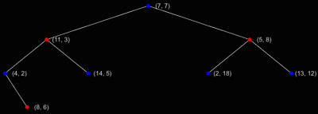
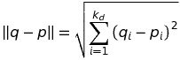

# k-d treeによる最近傍探索　

## 1: Introduction
問題としてD次元ユークリッド空間 __R^D__ においてベクトル集合 S の中から、与えられたqとの最近傍であるpを求めたい。この場合線形探索では元の数が少なければ問題ないが、数が増えれば増える程計算量に無駄が生じ、CPUへの負荷が予想される。そこで今回は k-d tree (k-dimensional tree) を用いた最近傍探索を検証、学習し解へのアプローチを試みることにした。

### 1.1 Definition


## 2: k-d tree 

### 2.1 基本概要

バイナリ空間分割を多次元で行うデータ構造であり、BSP tree の特殊版とされる。
高次元になるほど線形探索と変わらなくなってしまうので、探索対象の情報量をnとすると n >> 2^D となるのが望ましい。  


### 2.2 k-d treeの構築

はじめに集合Sからk-d treeの構築を行う。（今回は例として二次元上と仮定する）

#### 2.2.1 考え方

木の構築には __ルート__となる起点を始めに決定し、そこからノードを二分化してゆく。  
この二分化の際にbinary treeと異なる点は二次元であるためノードの深さが重なるごとに交互に比較をしていかなければならない。（二次元以上でも同様）  
今回はルートの深さを1として、深くなるたびに、奇数でx、偶数でyを比較する。  
サンプルとして次の二次元上の点 (2,3), (5,4), (9,6), (4,7), (8,1), (7,2) で考える。  


今回 (7, 2)をルートとし、この際xが __7__ よりも大きいデータとそれ以外のデータを左右で分ける。  
データは以下のような集合に分割される。  

__R = { (8, 1), (9, 6) }__  
__L = { (2, 3), (4, 7), (5, 4) }__

この分割された集合データをもとにさらに再帰的にノードを左右に構築する。(fig.1)


 __fig.1__  

  

 
__fig.2__ : 分割線


#### 2.2.2 平衡化と中央点
平衡化とは各ノードが部分的に多かったり少なかったりと形が左右不揃いな木(fig.3)ではなく高さを極力均一にすること(fig.4)である。また平衡化は探索の際にも影響が出るので、木の構築で最も重要とされる。
平衡化がされてない木からあるデータを問い合わせる際に最悪の場合、計算量がO(n)となってしまい線形探索と変わらなくなってしまう。

 
__fig.3__ : 不均衡な木


平衡化された木を構築するには __中央点__ を求めることが重要である。  
2.2.1ではルートとなる点を(7, 2)としたが、これは集合の値からxをもとにした中央点であり、各ノードではこの中央点を求めながら配置してゆく。  

 
__fig.4__ : 平衡化された木

k-d treeの構築コストは一般的にメディアンを求めるアルゴリズムに依存する。シンプルなソートであれば計算量はO(n log n)なので構築コストはO(n log^2 n)となる。  

__アルゴリズム__
```
Algorithm: build-a-balanced-k-d-tree
INPUT: Vector list, Node

e.g.)
IF Vector list is not empty or Node is empty THEN
	Get a median data from Vector list
	Set median data to node	
	Partition data into right and left from median
	Repeat this processing recursively
```

### 2.4 ノードの挿入
構築された木へのノード追加の単純な方法として、入力値である追加ノードを順に比較してゆき末端に追加する方法がある。  
具体的には{ (7, 7), (11, 3), (5, 8), (4, 2), (14, 5), (2, 18), (13, 12) }から生成されたk-d tree (fig.5)に新たなノード(8, 6)を追加する際、ルートである(7, 7)から末端まで辿り適応する箇所にノードを追加する。(fig.6)

 __fig.5__

 __fig.6__

ノードの挿入についての計算量は木の高さに依存するため、平衡化されている状態でO(log n)である。

### 2.5 ノードの削除
アプローチの内の一つとして以下の方法を紹介する。  
ルートから削除点を検索し目的地に到達した際、到達点の左右の子ノードが存在しない場合は削除して完了。もし子ノードが１つ以上存在する場合は削除点よりも下層のデータを上へずらさなければならない。  
この場合、削除点より下層のデータを元に削除点から木を再構築するのが最も単純である。


__アルゴリズム__
```
Algorithm: delete-a-node

e.g.)
Repeat pursuing recursively to hitting target node from root
IF target node doesn't have any child node THEN
	Delete a target node
ELSE
	Rebuild a tree with data that is under deleting point from this point
```


## 3: 最近傍探索
k-d tree上に存在しないクエリ点qを新たに指定し、qから最近傍点であるpとその距離d(q,p)を集合 __S__ の中から求める。


### 3.1 考え方

ルートからqが位置する超矩形を再帰的に求める。 ...①  
①で求めた末端ノードp(暫定最短データとする)とqとの距離をrとし、保持し続け最短データ以下のモノが見つかった時点で更新する。(fig7)
 __fig7__  
qを中心点とした半径rの超球がqとp.axisを比較した際にqが位置していなかった逆方向の超矩形Rに重なっていた場合、Rの方もバックトラッキングにより探索する。


### 3.2 計算量

k-d treeの最近傍探索の計算量は平均O(log n)これはあくまで木の高さが __平衡化__ されていると仮定したときの計算量であり、木の構造によっては最悪計算量O(n)となってしまうので注意が必要である。


## 4: Conclusion
以上の結果、膨大なデータや頻度が多い場合などに力まかせのサーチでは非常に無駄が多くなるのでk-d treeを導入するメリットは十分あることがわかる。
ただ、ゲームなどのフレーム処理のような場面では木を毎回構築し直すことにより逆に負荷が掛かってしまっては本末転倒になってしまうので、少し工夫が必要になる。